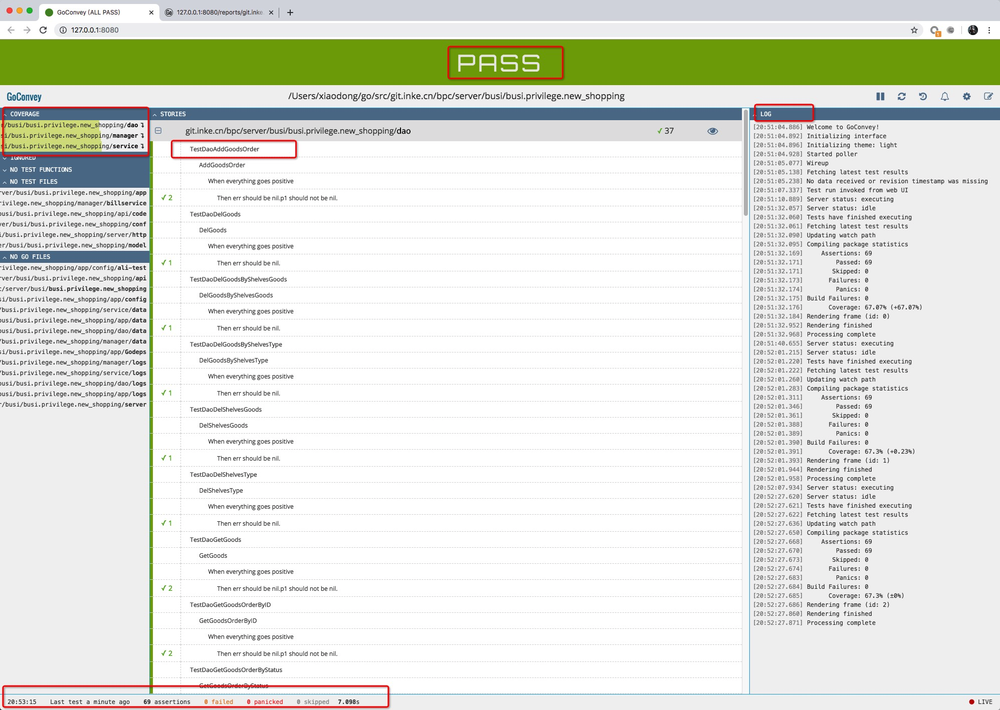

## UnitTesting代码生成器
## 快速开始
安装：
```go
go get -u git.inke.cn/BackendPlatform/daenerys-tool/...
```
使用方式
在dao、service、manager目录下面执行
```go
testgen 
```
生成所有文件的测试文件_test.go，如：
```go
.
├── dao.go
├── dao_test.go
├── goods.go
└── goods_test.go

```
生成代码示例：
```go
// dao_test.go
package dao

import (
	"os"
	"testing"

	"git.inke.cn/bpc/server/busi/busi.privilege.new_shopping/conf"
	"git.inke.cn/inkelogic/daenerys"
)

var (
	d *Dao
)

func TestMain(m *testing.M) {
	daenerys.Init(daenerys.ConfigPath("../app/config/ali-test/config.toml"))
	conf, err := conf.Init()
	if err != nil {
		return
	}
	d = New(conf)
	m.Run()
}

// goods_test.go
package dao

import (
	"context"
	"testing"

	"git.inke.cn/bpc/server/busi/busi.privilege.new_shopping/model"
	. "github.com/smartystreets/goconvey/convey"
)

func TestDaoUpdateGoods(t *testing.T) {
	Convey("UpdateGoods", t, func() {
		var (
			ctx = context.Background()
			req = model.Goods{
				Name: "test",
				Type: 1,
			}
		)
		Convey("When everything goes positive", func() {
			p1, err := d.UpdateGoods(ctx, req)
			Convey("Then err should be nil.p1 should not be nil.", func() {
				So(err, ShouldBeNil)
				So(p1, ShouldNotBeNil)
			})
			d.DelGoods(ctx, p1)
		})
	})
}

func TestDaoGetGoods(t *testing.T) {
	Convey("GetGoods", t, func() {
		var (
			ctx = context.Background()
			req model.GoodsGetReq
		)
		Convey("When everything goes positive", func() {
			p1, err := d.GetGoods(ctx, req)
			Convey("Then err should be nil.p1 should not be nil.", func() {
				So(err, ShouldBeNil)
				So(p1, ShouldNotBeNil)
			})
		})
	})
}

func TestDaoDelGoods(t *testing.T) {
	Convey("DelGoods", t, func() {
		var (
			ctx = context.Background()
			id  = int64(0)
		)
		Convey("When everything goes positive", func() {
			err := d.DelGoods(ctx, id)
			Convey("Then err should be nil.", func() {
				So(err, ShouldBeNil)
			})
		})
	})
}
```
当前目录执行：
```
go test -v
```

如果添加新方法可以使用：
```go
testgen -f func
```
说明：默认追加到对应测试文件   
配置文件默认使用测试环境配置进行测试，如果不想依赖测试环境可以对各个依赖进行mock


#### 框架mock支持
redis
```go
// new redis mocker
redis, close, err := redis.NewMockRedis()
if err != nil {
    return
}
defer close()
// inject mock redis
daenerys.Default.AddRedisClient("redis-name", redis)
```

mysql
```go
// 生成一个mockMysql
sqlClient, closeFn, _ := sql.NewMockSQL("../sql.sql")
defer closeFn()
// 注入到新框架
daenerys.Default.AddSqlClient("mysql-name", sqlClient)
sql.SQLGroupManager.Add("mysql-name", sqlClient) // 注入到老框架

```
kafka
```go
// new sync mock producer client
syncClient, mock, _ := kafka.NewMockSyncProducerClient()
mock.ExpectSendMessageAndSucceed() // 期待收到一条消息
daenerys.Default.AddSyncKafkaClient("sync-producer-name", syncClient)

// new async mock producer client
asyncClient, amock, _ := kafka.NewMockAsyncProducerClient()
amock.ExpectInputAndSucceed() // 期待收到一条消息
daenerys.Default.AddAsyncKafkaClient("async-producer-name", asyncClient)
	

```

http
```go
	
// new http mock client
mockHTTPClient := client.Func(func(req *client.Request) (*client.Response, error) {
    if req.RawRequest().URL.Path != "/api/user/info" {
        return nil, errors.New("not allowed")
    }
    resp := &http.Response{
        StatusCode: 200,// http状态码
        Body:       ioutil.NopCloser(bytes.NewBuffer([]byte(`{"uid":1,"nick":"tom"}`))),// 响应内容
    }
    return client.BuildResp(nil, resp)

})
daenerys.Default.AddHTTPClient("http-client-name", mockHTTPClient)
```
其他函数  
其他函数mock可参考：https://code.inke.cn/BackendPlatform/monkey


各个mock组件注入时机（需要在框架初始化完成之后）：
```go
func TestMain(m *testing.M) {
	// 初始化框架
	daenerys.Init(daenerys.ConfigPath(""))
	// 初始化配置
	conf, err := conf.Init()
	if err != nil {
		return
	}
	d = New(conf)

	// 创建一个mock redis（功能和实际实例一致）
	redis, close, err := redis.NewMockRedis()
	if err != nil {
		return
	}
	defer close()
	// inject mock redis
	daenerys.Default.AddRedisClient("redis-name", redis)

	// run testing
	m.Run()
}
```
### 效果


### 参考链接

